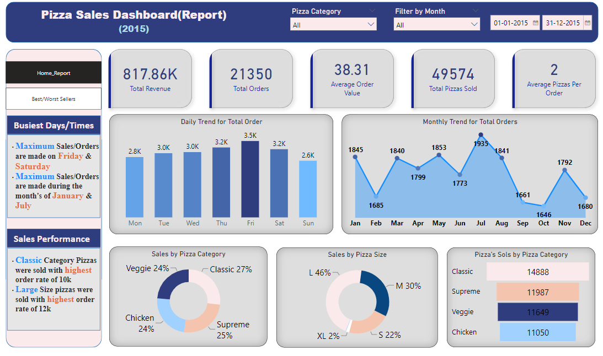
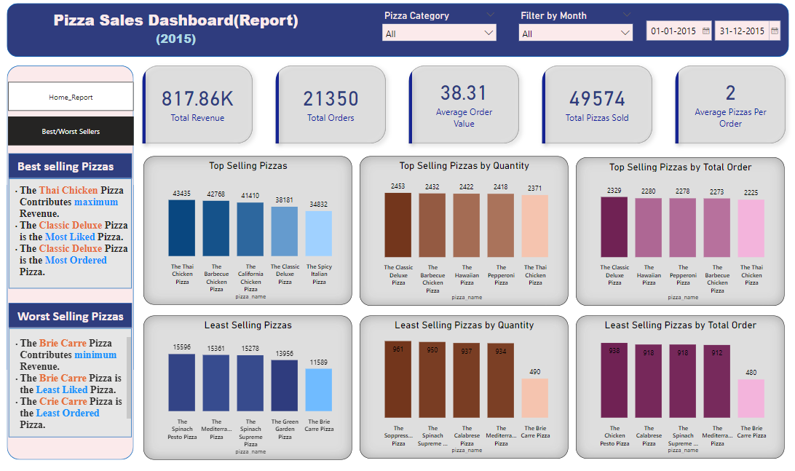

# Pizza Sales Report with SQL and Power BI

Welcome to the **Pizza Sales Report** project, where we utilize SQL for comprehensive data analysis and Power BI to create dynamic, interactive visualizations. This project offers detailed insights into pizza sales data, highlighting daily and monthly trends, sales performance across different pizza categories and sizes, and identifying top-selling pizzas by revenue, quantity, and total orders.

## Table of Contents

- [Features](#features)
- [Getting Started](#getting-started)
- [Data Analysis with SQL](#data-analysis-with-sql)
- [Creating Dashboards with Power BI](#creating-dashboards-with-power-bi)
- [Dashboard Overview](#dashboard-overview)
- [How to Use the Dashboard](#how-to-use-the-dashboard)
- [Contributors](#contributors)
- [Feedback and Contributions](#feedback-and-contributions)

## Features

- **Daily and Monthly Trends**: Visualize the number of pizza orders and sales figures over time, allowing for the identification of peak sales periods.

- **Pizza Category Analysis**: Examine sales across different pizza categories to understand customer preferences and trends.

- **Pizza Size Analysis**: Analyze sales distribution by pizza size to tailor offerings based on customer choices.

- **Top-Selling Pizzas**: Identify the most popular pizzas based on various metrics, providing insights to optimize menu offerings and boost profitability.

## Getting Started

1. **Data Analysis with SQL**:
   - The initial data analysis was conducted using SQL. You can find the SQL scripts and queries used for data extraction, transformation, and analysis in the <a href="pizza_sales_analysis.sql">sql_sales_analysis.sql</a> file in this repository.

2. **Creating Dashboards with Power BI**:
   - The Power BI project file <a href="pizza_sales_report.pbix">pizza_sales_report.pbix</a> contains interactive dashboards. Customize and explore it using Power BI Desktop.

3. **Access the Dashboard**:
   - Open the `pizza_sales_report.pbix` file with Power BI Desktop to explore the interactive dashboards.

## Data Analysis with SQL

The SQL analysis involved extracting and transforming data to provide insights into pizza sales trends, top and least-selling pizzas, and category-based sales distribution. Key analyses include:
   - Tracking daily and monthly pizza sales and revenue trends.
   - Identifying top-selling pizzas by revenue, quantity, and total orders.
   - Highlighting the least-selling pizzas.
   - Analyzing sales distribution by pizza category and size.

## Creating Dashboards with Power BI

Power BI is utilized to create interactive dashboards that visualize pizza sales data. The `pizza_sales_report.pbix` file includes the following dashboards:

### Dashboard Overview

The **Pizza Sales Report** dashboards provide a user-friendly interface with the following views:

- **Trends**: Visualize daily and monthly sales trends.
- **Pizza Category Analysis**: Breakdown of sales by pizza category.
- **Pizza Size Analysis**: Distribution of sales by pizza size.
- **Top-Selling Pizzas**: Highlighting the most popular pizzas based on key metrics.
- **Least-Selling Pizzas**: Identifying pizzas with lower sales.

### Home Page Report Dashboard

### Best/Worst Sellers Report Dashboard

### How to Use the Dashboard

1. **Install Power BI Desktop**:
   - Download and install [Power BI Desktop](https://powerbi.microsoft.com/desktop/).

2. **Open the Project File**:
   - Launch Power BI Desktop and open the `pizza_sales_report.pbix` file.

3. **Explore the Dashboards**:
   - Navigate between different views using the tabs on the left side.

4. **Interact with Visuals**:
   - Use the interactive features to hover, click, and filter data for deeper insights.

## Contributors

- [Shakti Siddharth Ray](https://github.com/ShaktiRay) - Project Creator and Maintainer

## Feedback and Contributions

I welcome your feedback, suggestions, and contributions. If you have ideas for improvement, find any issues, or wish to add new features, feel free to open an issue or submit a pull request. Your contributions are highly valued!

---

Explore the **Pizza Sales Report** to make informed decisions, enhance your menu, and drive your pizza business to success. Thank you for choosing our tool!

If you find this project valuable, please consider starring ⭐ the repository and sharing it with others. Together, we can revolutionize productivity!

## Thank you..!!, SHAKTI SIDDHARTH RAY

---
